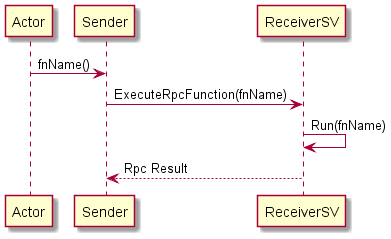
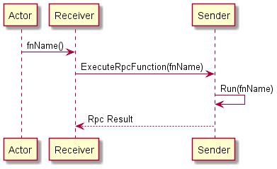
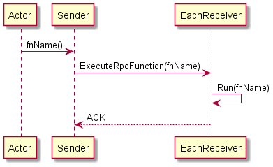

# Remote Procedure Call
## 1. Definition
In distributed computing, a remote procedure call (RPC) is when a computer program causes a procedure (subroutine) to execute in a different address space (commonly on another computer on a shared network), which is coded as if it were a normal (local) procedure call, without the programmer explicitly coding the details for the remote interaction.

## 2. RPC in Auto-magic Networking System
The main idea is to allow Senders and Receivers to call functions almost as easily as if they were called within the same instance.

## 3. Interactions

### 3.1. Rpc Call - Sender (client) calls to Receiver (server)
The Sender is on client-side.
The Receiver is on server-side (and it's replicated on the rest of clients).

The Sender calls to the Server-side Receiver's function, in order to receive an answer.



[Diagram code](./Diagrams/rpc/rpc_sender_call.plantuml)

#### How to call it?
In the Sender, you must call:
```
nw_rpc_sender_call("my_function", myArgs, myCallback);
```
The callback will run once the Sender receives the answer from the Receiver.
_The function will fail if the sender is not running on client-side._

### 3.2. Rpc Call - Receiver (client or server) calls to Sender (server or client)
The Receiver calls to the Senders's function, in order to receive an answer.



[Diagram code](./Diagrams/rpc/rpc_receiver_call.plantuml)

#### How to call it?
In the Receiver, you must call:
```
nw_rpc_receiver_call("my_function", myArgs, myCallback);
```
The callback will run once the Receiver receives the answer from the Sender.

### 3.3. Rpc Call - Sender (client or server) broadcasts to Receivers (server or client)
The Sender broadcasts calling each Receiver's function. It won't expect an answer, but an [ACK](https://en.wikipedia.org/wiki/Acknowledgement_(data_networks)).



[Diagram code](./Diagrams/rpc/rpc_sender_broadcast.plantuml)


#### How to call it?
In the Sender, you must call:
```
nw_rpc_sender_broadcast("my_function", myArgs, myCallback);
```
The callback will run once the Sender receives all ACK signals.

